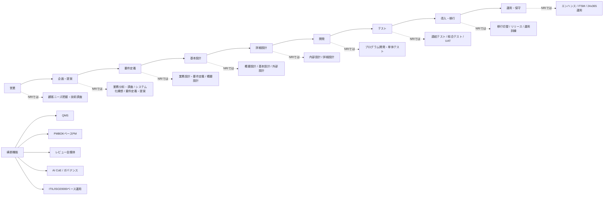
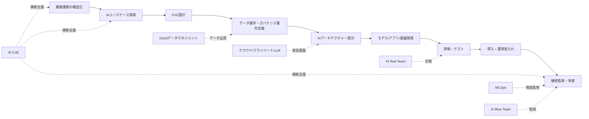

# NRIにおけるSIer業務フローの詳細対応レポート

## Executive Summary

NRIのSIer業務を理解するうえで最も重要なのは、NRIが自社の強みを「ナビゲーション（問題発見から解決策を導くコンサルティング）」と「ソリューション（システム開発・運用などで課題解決を実現する機能）」の一貫提供に置いている点です。したがって、NRIの実像は「受注して開発する会社」というより、「構想・提案・要件化・設計・開発・運用・BPOまでを業界知見と標準化された方法論でつなぐ会社」と捉える方が正確です。これは、IRで示される「ナビゲーション×ソリューション」の説明、採用ページの各事業本部説明、そしてITサービス管理・開発標準の公開資料が整合的に示しています。citeturn35view0turn16view0turn4view0

一般的なSIer工程と比べたとき、NRIで特に解像度を上げておくべきズレは三つあります。第一に、営業と企画・提案は、単なる商談獲得ではなく「業務分析・調査」「システム化構想」「要件定義・提案」まで滑らかにつながっていること。第二に、NRIでいう「概要設計」が、一般的な要件定義と基本設計の中間ではなく、業務・機能・性能・運用・セキュリティ要件をまとめる非常に重い上流工程として位置づくこと。第三に、運用・保守が単純な障害対応ではなく、「エンハンス業務」「ITサービス管理」「共同利用型サービス」「BPO」まで含む継続的な価値提供として捉えられていることです。citeturn3view0turn5view0turn23view0turn35view0turn34view0

AI案件でも、NRIは既存のSIフローを捨てるのではなく、その上にAI CoE、ユースケース探索、PoC、Goodデータマネジメント、AIアーキテクチャー、MLOps、AI Red Team／AI Blue Team、継続改善といった要素を重ねています。つまり、AI案件を特別視しすぎるよりも、「NRIは既存の大規模SIのガバナンスと運用力の上にAIを載せにいく会社」と理解すると、面接でも一貫した説明がしやすくなります。citeturn23view0turn14view1turn31view0turn32view0turn14view4

面接対策という観点では、全工程を均等に語るよりも、「どの工程で価値を出せる人材か」と「前後工程をどうつなげるか」を語る方が刺さります。NRIの公開情報を踏まえると、特に評価されやすいのは、課題の構造化、関係者調整、曖昧な要件の具体化、品質とリスクの先回り、運用を見据えた設計、そしてAI活用時のガバナンス意識です。citeturn16view0turn7view0turn23view0turn15view3

## NRIのSIer業務を読む前提

NRIの公開情報を突き合わせると、役割分担はおおむね次のように整理できます。コンサルティング事業本部とシステムコンサルティング事業本部は、経営・事業・ITの戦略、システム化構想、プロジェクトマネジメント、ITマネジメント、ITアーキテクチャー、サービスデザインなどの上流を担います。一方、証券・金融・資産運用・保険・流通・産業・通信サービスなどの各ソリューション事業本部は、顧客業界の業務に根差したアプリケーションエンジニアが中心となり、構想・計画から設計・開発・運用・アウトソーシングまでを担います。技術横断では、デジタルトラスト基盤事業本部がセキュリティやデジタルワークプレイス、生産革新センターが開発生産性向上やAI活用支援、マルチクラウドインテグレーション事業本部が基盤設計・開発・運用、データセンターサービス本部が24時間365日の運用とITサービスマネジメントを担います。さらに、NRIセキュアがセキュリティ専門機能を提供します。citeturn16view0turn15view3

職種名・専門資格の観点では、公開採用上はアプリケーションエンジニア、テクニカルエンジニア、経営コンサルタント、セキュリティスペシャリストなどが前面に出ていますが、社内認定資格としては認定ビジネスディベロッパー、認定ビジネスアナリスト、認定プロジェクトマネージャ、認定アプリケーションエンジニア、認定ITアーキテクト、認定ITサービスマネージャ、認定データサイエンティストが明示されています。つまり、公開職種名と実務能力の認定軸は一致している部分もあれば、より細かく分かれている部分もあります。営業機能については独立した新卒職種名としては前面に出ていませんが、社内資格のBD、公開論考の執筆者プロフィールにある「企画・提案・営業」の明記から、案件獲得・提案機能が確実に存在することは確認できます。ただし、営業組織の厳密な分掌は公開情報では未確認です。citeturn14view5turn33view0

AEとTEの役割差も、NRIを理解するうえで重要です。NRIの公式図では、ITソリューションは「顧客ニーズ／ウォンツ」を起点に、技術調査、業務分析・調査、要件定義・提案、システム設計、業務設計、システム開発、システムテスト・UAT、リリース・保守・運用へ流れていき、その中でAEは業務に関する部分を主に担当し、TEは基盤技術に関する部分を主に担当すると整理されています。したがって面接でNRIを語るときは、「業務×技術」をつなぐ会社、あるいは「AEとTEが接続しながら顧客業務を新しい業務へ変えていく会社」と表現するとズレにくいです。citeturn2view0turn3view0

NRIはこの一連の流れを、個人技ではなく標準化された方法論で回そうとしている点にも特色があります。公開されているサービス管理資料では、QMS、開発プロセス標準、プロジェクト管理標準、エンハンス業務標準、ITサービス管理標準の五つを柱として示し、開発から保守・運用までを標準プロセス、レビュー、テンプレート、定量指標で支える仕組みが紹介されています。したがって、NRIの業務フローは「各工程の作業内容」を覚えるだけでなく、「標準、レビュー、リスク管理、ナレッジ再利用」が各工程を横断するという読み方が必要です。citeturn4view0turn5view0turn7view0

以下の図は、公開情報をもとに一般的SIer工程とNRIの呼称を重ねて再構成したものです。citeturn3view0turn5view0turn23view0

主要出典URL: `https://working.nri.co.jp/recruit/contents/business/ourjobs/ourjobs_b.html` `https://working.nri.co.jp/recruit/contents/business/field/` `https://www.nri.com/content/900038887.pdf` `https://www.nri.com/jp/service/theme/ai/generative_ai.html`。citeturn2view0turn16view0turn5view0turn23view0

## 一般的SIer工程との対応表

| 一般的SIer工程 | NRIで近い工程・呼称 | 対応の読み方 | 主担当の例 | AI適用の焦点 |
|---|---|---|---|---|
| 営業 | 顧客ニーズ／ウォンツ把握、技術調査、業務分析・調査の入口。公開情報上、企画・提案・営業機能の存在は確認できるが、厳密な組織分掌は一部未公開。 citeturn3view0turn33view0turn14view5 | NRIでは営業だけが独立して前に出るというより、提案・構想と一体で動く理解が近い。 | BD相当人材、システムコンサルティング、各ソリューション事業本部 | 課題仮説、AI適用テーマ探索、案件化の見極め citeturn23view0 |
| 企画・提案 | システム化構想、システム化計画、要件定義・提案、AI CoE伴走、AIユースケースディスカバリ。 citeturn16view0turn5view0turn23view0 | 一般的な「企画・提案」よりも、構想策定とロードマップ設計まで踏み込む。 | コンサルティング事業本部、システムコンサルティング事業本部、各ソリューション事業本部 | PoCテーマ選定、ROI仮説、AIロードマップ、CoE整備 citeturn22view0turn23view0 |
| 要件定義 | 業務設計・要件定義、概要設計。 citeturn5view0turn34view0 | NRIの概要設計は、一般的な要件定義と基本設計の間にある軽い工程ではなく、目的・範囲・業務・機能・性能・運用・セキュリティを定める重い工程。 | システムコンサル、AE、顧客業務部門、情シス | データ要件、Goodデータ、非機能・ガバナンス要件、法務・セキュリティ調整 citeturn23view0turn14view4 |
| 基本設計 | 概要設計、基本設計、外部設計。 citeturn5view0turn34view0 | NRIでは「概要設計→基本設計→内部設計」と粒度が細かく、要件から設計への橋渡しを厚くしている。 | AE、ITアーキテクト、TE | AIアーキテクチャー、UI・連携・認証・ログ・セキュリティ設計 citeturn23view0turn14view1 |
| 詳細設計 | 内部設計、詳細設計、共通部品・ミドルウェア設計、環境設計。 citeturn7view0turn8view0 | 単なるプログラム設計ではなく、基盤・共通部品・ライブラリ管理も含む。 | AE、TE、基盤系部門 | モデル実装方針、推論フロー、MLOps設計、データパイプライン設計 citeturn14view1turn25view0 |
| 開発 | プログラム開発・単体テスト、システム開発。 citeturn7view0turn2view0 | 開発標準・共通化・レビューで品質ばらつきを抑える思想が強い。 | 各ソリューション事業本部AE、TE、生産革新センター、協力会社 | AIアプリ実装、既存システム連携、開発生産性向上へのAI適用 citeturn14view1turn15view3 |
| テスト | 連結テスト、総合テスト、ユーザ受入テスト、基盤総合テスト。 citeturn7view0turn8view0 | NRIはテストをかなり細かく分け、定量指標・障害収束・レビューで管理する。 | PM、AE、TE、顧客業務部門、情シス | 精度評価、データ検証、セキュリティ診断、AI Red Team、継続監視設計 citeturn31view0turn32view0 |
| 導入・移行 | 移行切替要件定義、移行切替方式設計、移行リハーサル、本番移行切替、リリース推進。 citeturn7view0turn8view0 | 導入直前ではなく、上流から移行切替要件を詰める設計思想。 | PM、AE、TE、運用組織、顧客現場 | AI環境デプロイ、モデル配備、権限制御、運用受入れ、移行後監視 citeturn31view2turn32view0 |
| 運用・保守 | リリース・保守・運用、エンハンス業務、ITサービス管理、共同利用型サービス、BPO。 citeturn3view0turn8view0turn35view0 | NRIの運用は、単なる保守ではなく標準化、自動化、継続改善、BPOまで含む。 | データセンターサービス本部、マルチクラウドインテグレーション、各ソリューション保守組織、NRIプロセスイノベーション、NRIセキュア | 精度監視、再学習、変更管理、AI Blue Team、ガバナンス運用、MLOps citeturn15view3turn14view1turn32view0 |

この対応表の核心は、「NRIでは要件定義・概要設計・基本設計の境目が厚く、運用・保守はエンハンスとITSMまで拡張される」という点です。したがって、面接で一般的SIerの工程をそのまま話すよりも、NRIの言葉に翻訳して語れると理解の深さが伝わります。citeturn34view0turn8view0turn35view0

主要出典URL: `https://working.nri.co.jp/recruit/contents/business/ourjobs/ourjobs_b.html` `https://working.nri.co.jp/recruit/contents/business/field/` `https://www.nri.com/content/900038887.pdf` `https://www.nri.com/jp/service/theme/ai/generative_ai.html` `https://www.nri.com/jp/news/newsrelease/20231218_2.html` `https://www.nri.com/jp/news/newsrelease/20240619_1.html`。citeturn3view0turn16view0turn5view0turn23view0turn31view0turn32view0

## 上流工程の詳細

### 営業

**目的**は、顧客の「ニーズ／ウォンツ」を受け取るだけでなく、業務上の論点とシステム化余地を仮説化し、提案可能なテーマへ案件化することです。**主要タスク**は、業界・制度・競合・顧客現場の情報収集、初回ヒアリング、課題仮説づくり、技術調査、概算スコープ整理、提案体制の組成です。**関係者**は、顧客側では経営層、業務部門、情シス、時に法務・セキュリティ部門、社内ではシステムコンサルティング事業本部、各ソリューション事業本部、企画・提案・営業機能を持つ人材、必要に応じてTEや協力会社です。**典型的成果物**は、公開情報で固定テンプレート名は未確認ですが、一般にはヒアリングメモ、課題整理、提案骨子、概算見積、体制案がここで生まれ、その後のシステム化構想や提案書に接続します。citeturn3view0turn16view0turn33view0turn14view5

**NRIでの対応**としては、営業と提案が分断されているより、ナビゲーション×ソリューションの起点として機能していると読むのが近いです。システムコンサルティング事業本部はシステム化構想やITマネジメント、プロジェクトマネジメント支援を担い、各ソリューション事業本部は業界知見をもって構想・計画立案から設計・開発・運用まで提供します。AI案件では、この段階から「AIを入れること」ではなく、どの業務・顧客接点・IT業務にどの効果を出すかというユースケース探索が始まります。**時間軸・期間感**は、既存顧客の追加提案なら数日〜数週間、新規大型案件では一〜二か月程度が一般的目安ですが、NRI固有の公開数値は未確認です。citeturn35view0turn16view0turn23view0

**よくある課題・リスク**は、課題ではなく製品を売ってしまうこと、顧客内の意思決定者を特定できないこと、スコープを甘く見て後工程の負債を生むことです。NRI的な対策は、上流構想機能を前に出して「何を解くか」を先に明確化すること、顧客業務とITの両面理解をもつ人材を入れること、後工程まで見越して構想段階で論点整理をすることです。**面接でエピソード化するヒント**は、「まだ要件がない段階で、どう相手の曖昧な悩みを整理したか」を語ることです。たとえば、課題の仮説立て、論点の分解、ヒアリング項目設計、初期関係者の巻き込みなどは、この工程との相性が非常に良いです。citeturn16view0turn35view0

面接で使える短文例  
[自己PR] 「私は、相手がまだ言語化できていない課題を、論点に分けて整理するところに強みがあります。」  
[志望動機] 「NRIで、業界知見と技術知見を掛け合わせながら、提案の入口から価値を出したいです。」  
[自己PR] 「仮説を持ってヒアリングし、次工程につながる材料を整える動きが得意です。」  

主要出典URL: `https://working.nri.co.jp/recruit/contents/business/ourjobs/ourjobs_b.html` `https://working.nri.co.jp/recruit/contents/business/field/` `https://ir.nri.com/jp/ir/individual/strength/strength04.html` `https://www.nri.com/data/jp/knowledge/files/900033690.pdf`。citeturn3view0turn16view0turn35view0turn33view0

### 企画・提案

**目的**は、顧客課題を「解く価値があるテーマ」に変え、実現シナリオ・費用対効果・体制・ロードマップまで含めて提案することです。**主要タスク**は、業務分析・調査、システム化構想、システム化計画、要件定義・提案、優先順位づけ、投資対効果の試算、プロジェクト計画作成の前提整理です。**関係者**は、顧客側では事業責任者、業務責任者、情シス、経営層、社内ではコンサルタント、システムコンサルタント、AE、TE、PM候補、必要に応じてセキュリティやデータ基盤、運用部門です。**典型的成果物**は、システム化構想、システム化計画、提案書、概算見積、体制案、ロードマップ、PoC計画などで、NRI標準資料には「システム化計画」「プロジェクト計画作成」が明確に見えます。citeturn16view0turn5view0turn7view0

AIの文脈では、この工程が特に厚くなります。NRIはAI CoE伴走として、全社方針・ロードマップ整備、ケース／ナレッジのキュレーション、AI専門／活用人材育成を支援すると説明しています。また、AI業務改革ではCX、OX、EX、ITXの四つの観点でユースケース探索を行い、企画からPoC、実装、効果創出まで一気通貫で支援するとしています。さらに、AIコンサルティングの公開リリースでは、業務改革のPoCを通じてシステム構想をつくり、その開発・実装を推進すると記載されています。**時間軸・期間感**は、一般に一〜三か月が目安ですが、PoC併走型ではさらに伸びます。citeturn22view0turn23view0turn14view2turn24search2

**よくある課題・リスク**は、PoC止まり、AIありき、部門間の目線不一致、法務・セキュリティ・データ部門の巻き込み不足です。NRI公開情報からの示唆は、CoEを置いて全社方針と窓口を一元化すること、短中長期ロードマップを置くこと、ビジネス課題起点でユースケースを選ぶことです。**面接でエピソード化するヒント**は、「企画をやりたい」では弱く、「何を基準に優先順位をつけ、どう関係者を納得させたか」まで語ることです。PoC経験があるなら、検証項目、判断基準、やめる勇気まで語れると上流理解が深く見えます。citeturn22view0turn23view0turn14view2

面接で使える短文例  
[志望動機] 「NRIで、単発の提案ではなく、構想から実装まで責任を持てる提案をしたいです。」  
[自己PR] 「私は、複数案を作って終わるのではなく、優先順位と実行順まで落とし込むことを意識しています。」  
[自己PR] 「PoCでは、精度そのものだけでなく、業務に乗るかどうかの観点で判断材料を整えてきました。」  

主要出典URL: `https://working.nri.co.jp/recruit/contents/business/field/` `https://www.nri.com/content/900038887.pdf` `https://www.nri.com/jp/service/theme/ai/generative_ai.html` `https://www.nri.com/jp/news/newsrelease/20240126_1.html` `https://www.nri.com/jp/knowledge/publication/kinyu_itf_201708/05.html`。citeturn16view0turn5view0turn23view0turn14view2turn24search2

### 要件定義

**目的**は、顧客が本当に実現したい業務変革とシステム化範囲を明文化し、後工程でぶれない判断基準をつくることです。NRIの公開論考では、概要設計はシステムの目的、システム化の範囲、業務・機能・性能・運用・セキュリティなどの要件を定義する工程であり、予算見積もりやプロジェクト計画書の入力情報となる極めて重要な文書と位置づけられています。したがって、一般的なSIerでいう要件定義の重心が、NRIでは「業務設計・要件定義」と「概要設計」にまたがっていると捉えるべきです。citeturn34view0turn5view0

**主要タスク**は、As-Is／To-Be整理、業務フロー整理、課題一覧化、機能要件と非機能要件の定義、スコープ確定、課題管理、受入観点の整理です。**関係者**は、顧客業務部門、情報システム部門、各部署責任者、社内のシステムコンサル、AE、TE、PM、必要に応じて法務、セキュリティ、データ責任者です。NRIの公開資料では、顧客業務部署や情報システム部門、ベンダーPMや担当者が最初のミーティングで課題解消の遅れが費用やスケジュールに影響することを共有することが有効だとしています。**典型的成果物**は、要件定義書、概要設計書、業務要件一覧、課題管理表、業務フロー、非機能要件一覧が中心で、NRI標準ではプロジェクト計画書やレビュー証跡も早い段階から紐づきます。citeturn34view0turn6view0

AI案件では、ここで追加される論点が多いです。NRIはAI基盤整備として、AIガバナンス整備・実行、AIアーキテクチャー設計・整備、Goodデータマネジメントを挙げています。要件定義では、通常の機能要件に加え、学習・推論に使うデータの範囲、正確性・鮮度・権利、回答責任、説明可能性、機密情報の扱い、外部LLMかプライベートLLMか、RAGの要否、プロンプトの統制、監査ログの取り方まで要件化する必要があります。NRIグループAI基本方針でも、情報セキュリティ、安全性、透明性、法令遵守・権利保護、AIガバナンス・人材育成が骨子として示されています。**時間軸・期間感**は、一般に一〜三か月程度ですが、部門調整が多い案件やAI案件では長くなりがちです。citeturn23view0turn14view4turn31view2

**よくある課題・リスク**は、要件のあいまいさ、部署横断調整の遅延、非機能要件の粗さ、テストで確認できない書き方です。NRIの公開論考は、概要設計時点で各部署間調整を顧客に意識してもらうこと、費用とスケジュール影響を見える形で伝えること、総合テストやUATで使うケースに落とせる形で要件を整理することの重要性を強調しています。**面接でエピソード化するヒント**は、「言われた要件をまとめた」ではなく、「曖昧な要件を、テスト可能な条件や意思決定可能な選択肢へ変換した」と語ることです。citeturn34view0

面接で使える短文例  
[自己PR] 「私は、曖昧な要望をそのまま受け取らず、判断基準になる要件まで具体化することを意識しています。」  
[志望動機] 「NRIのように、業務・運用・セキュリティまで含めて要件を固める仕事に魅力を感じます。」  
[自己PR] 「関係部署の前提がずれているときほど、論点を可視化して合意形成する力を発揮できます。」  

主要出典URL: `https://www.nri.com/content/900038887.pdf` `https://www.nri.com/data/jp/knowledge/files/900033690.pdf` `https://www.nri.com/jp/service/theme/ai/generative_ai.html` `https://www.nri.com/jp/news/info/20240215_1.html` `https://www.nri.com/jp/news/newsrelease/20240111_2.html`。citeturn5view0turn34view0turn23view0turn14view4turn31view2

### 基本設計

**目的**は、要件を実装可能なシステム構造へ落とし込み、外部設計として画面・帳票・インターフェース・データ・権限・運用方式などを定めることです。NRI標準フレームワークでは、システム化計画の後に概要設計、基本設計、詳細設計〜単体テスト、連結テスト、総合テスト、ユーザ受入テスト、移行・リリースが並んでおり、基本設計は全体設計から各サブシステム実装へ降ろすハブの役割を持ちます。**主要タスク**は、機能配置、インターフェース設計、データ構造、方式方針、運用要件の設計、テスト観点へのマッピングです。**関係者**は、AE、ITアーキテクト、TE、顧客業務部門、情シス、運用担当、セキュリティ担当、場合により協力会社です。**典型的成果物**は、概要設計書、基本設計書、インターフェース定義、全体テスト計画、レビュー証跡などです。citeturn7view0turn34view0

AI案件に置き換えると、この工程で決まるのは「モデル単体」ではなく「AIを含む業務システム全体の構造」です。NRI AI基盤整備サービスは、複数のLLMが協調しつつ既存システムと連携し、価値源泉データと柔軟につながるアーキテクチャーの設計と実現を支援すると説明しています。また、NRI Solution Aiでは、業務や既存システムを意識した堅実なシステム開発と、MLOps・他システム連携・セキュリティ・運用管理を含む柔軟かつ堅牢なプラットフォーム構築を掲げています。つまり、AI案件の基本設計では、プロンプトやモデル選定よりも、既存業務・既存システム・運用・セキュリティとどう接続するかを先に詰める理解が重要です。**時間軸・期間感**は、一般に一〜三か月程度ですが、基幹や多接続案件ではさらに長くなります。citeturn23view0turn14view1

**よくある課題・リスク**は、要件と設計のトレーサビリティが弱いこと、性能や運用設計を後回しにすること、AIを“黒箱”として既存システムに雑に接続してしまうことです。NRI公開情報では、概要設計段階から後半工程のテストケースを意識すること、性能条件を処理量やピーク時条件まで分解しておくこと、標準テンプレートや過去類似案件の資産を活用することが重要だとされています。**面接でエピソード化するヒント**は、「使えるシステムにする設計」を語ることです。画面やAPIだけでなく、例外系、性能、監査、運用引継ぎまで見た経験は強いです。citeturn34view0

面接で使える短文例  
[自己PR] 「私は、要件をそのまま設計に写すのではなく、利用現場や運用まで見て構造化することを意識しています。」  
[志望動機] 「NRIで、業務設計とシステム設計をつなぐ基本設計の厚みに価値を出したいです。」  
[自己PR] 「例外系や非機能まで先に潰すことで、後工程の手戻りを減らす動きが得意です。」  

主要出典URL: `https://www.nri.com/content/900038887.pdf` `https://www.nri.com/data/jp/knowledge/files/900033690.pdf` `https://www.nri.com/jp/service/theme/ai/generative_ai.html` `https://www.nri.com/jp/service/solution/solution_ai.html`。citeturn7view0turn34view0turn23view0turn14view1

## 設計からテストまでの詳細

### 詳細設計

**目的**は、基本設計で決めた外部仕様を、プログラム・共通部品・ジョブ・データ処理・基盤設定などの具体的実装単位に落とし込むことです。NRI標準フレームワークでは、内部設計、詳細設計〜単体テスト、共通部品・ミドルウェア設計、環境設計、ライブラリ管理などが明示されており、詳細設計はアプリ設計だけで閉じず、基盤・共通化・環境整備と一体で進みます。**主要タスク**は、内部設計、処理フロー設計、DB物理設計、エラーハンドリング設計、ジョブ設計、共通部品設計、開発環境設計、単体テスト観点定義です。**関係者**は、AE、TE、基盤担当、共通部品担当、PM、協力会社開発メンバーです。**典型的成果物**は、詳細設計書、内部設計書、開発仕様書、単体テスト仕様書、環境設計書などです。citeturn7view0turn8view0

AI案件では、公開情報上の固定テンプレートは未確認ですが、ここで設計すべきものは明確です。たとえば、プロンプトテンプレート、RAGの検索フロー、ベクトルストア接続、モデル切替条件、推論API、ガードレール、ログ設計、再学習またはファインチューニングの条件、MLOps監視項目などです。NRI Solution Aiは、MLOps、データ連携、API連携、セキュリティ、運用管理を含むプラットフォームを掲げており、プライベートLLMはプライベートクラウドやオンプレミスでの動作、企業データによるカスタマイズ、周辺モジュール提供まで説明しています。つまり、NRI的な詳細設計では、モデルの性能だけでなく「どう業務で壊れずに使うか」を設計する視点が重要です。**時間軸・期間感**は、一般に一〜二か月、サブシステム分割時は二〜四か月以上になることもあります。citeturn14view1turn31view2

**よくある課題・リスク**は、詳細設計の粒度が人によってばらつくこと、共通部品との整合が弱くなること、AI案件で再現性やログ設計が甘くなることです。NRIが公開する開発プロセス標準は、標準フレームワーク、アクティビティ定義書、ドキュメント体系、生産技術ライブラリにより属人性を下げることを狙っています。**面接でエピソード化するヒント**は、「自分が設計した粒度が、後工程のレビュー・開発・テストでどう効いたか」を語ることです。設計段階での先回りが伝われば、単なる実装者ではなく上位視点があると見られます。citeturn6view0

面接で使える短文例  
[自己PR] 「私は、開発者が迷わず実装できる粒度まで設計を具体化することを意識しています。」  
[志望動機] 「NRIの標準化された設計・開発の中で、再利用性と保守性の高い設計を追求したいです。」  
[自己PR] 「AI案件でも、精度だけでなくログや例外時挙動まで含めて設計する姿勢を大事にしています。」  

主要出典URL: `https://www.nri.com/content/900038887.pdf` `https://www.nri.com/jp/service/solution/solution_ai.html` `https://www.nri.com/jp/news/newsrelease/20240111_2.html`。citeturn7view0turn8view0turn14view1turn31view2

### 開発

**目的**は、設計成果物を実装し、品質を作り込むことです。NRI公開資料では、開発プロセス標準はプロセスや成果物を標準化して検討漏れや品質ばらつきを防ぎ、第三者レビューの品質向上や協力会社集約によるコスト削減に資するとされています。**主要タスク**は、コーディング、設定、単体テスト、コードレビュー、共通部品の組み込み、ライブラリ管理、環境構築、障害修正です。**関係者**は、各ソリューション事業本部のAE、TE、共通基盤担当、生産革新センター、協力会社、クラウド基盤担当です。**典型的成果物**は、ソースコード、設定ファイル、単体テスト仕様書・報告書、ソフトウェア一式です。citeturn4view0turn6view0turn15view3

NRIでは開発そのものの生産性向上もテーマ化されています。生産革新センターは、AIを活用した新たな開発手法、開発フレームワーク、開発支援ツールの展開、開発部署への技術支援を通じて、NRI全体の開発生産性向上を支援すると説明しています。AI案件の具体例としては、NRI自主サービスの企画・開発PM、AIソリューション開発推進、需要予測を活用したAI発注システムのPoCとシステム開発、生成AI活用PoCなどがプロフィールや事例で確認できます。つまり、NRIの開発は「受託開発」だけでなく、「共通化」「生産革新」「プロダクト化」の色が比較的強いと理解しておくとよいです。citeturn15view3turn28view0turn29view1turn29view2

**よくある課題・リスク**は、実装品質の個人差、設計乖離、協力会社との認識ズレ、AI案件でのモデル・データ・アプリ間の責任分界の曖昧さです。公開資料上の対策は、標準プロセス、共通部品、レビュー、品質会議体、管理情報の統合蓄積です。**面接でエピソード化するヒント**は、「自分が速く書ける」よりも、「どう品質と再利用性を上げたか」「他者が保守しやすい形にしたか」を語る方がNRI文脈に合います。citeturn5view0turn34view0

面接で使える短文例  
[自己PR] 「私は、実装速度だけでなく、後から他者が読める品質を意識して開発してきました。」  
[志望動機] 「NRIで、標準化と生産革新の仕組みを活かしながら、大規模開発で価値を出したいです。」  
[自己PR] 「AIを使う場面でも、モデル・アプリ・運用の責任境界を明確にしながら開発を進められます。」  

主要出典URL: `https://www.nri.com/content/900038887.pdf` `https://working.nri.co.jp/recruit/contents/business/field/` `https://www.nri.com/jp/profile/yuki_kitamura.html` `https://www.nri.com/jp/profile/kazuki_fujita.html` `https://www.nri.com/jp/profile/takuya_fushihara.html`。citeturn4view0turn15view3turn28view0turn29view1turn29view2

### テスト

**目的**は、単に不具合を見つけることではなく、要件・設計・実装が顧客業務と運用条件の下で成立することを立証することです。NRI標準では、連結テスト、総合テスト、ユーザ受入テスト、基盤総合テスト、本番環境関連テストまで細かく分かれ、連結テスト計画書・報告書、総合テスト計画書・報告書、ユーザ受入テスト計画書・報告書、テスト・障害密度、障害収束グラフなどの成果物・管理情報が明示されています。**主要タスク**は、テスト計画、ケース設計、環境準備、実行、障害分析、収束判定、リリース判断です。**関係者**は、PM、AE、TE、顧客業務部門、情シス、基盤・運用担当、協力会社です。citeturn6view0turn7view0turn8view0

NRIの公開論考では、概要設計段階から総合テストのケース起こしを意識すべきであり、業務フローがケースシナリオに落とせるか、業務要件・機能要件が確認ポイントにマッピングできるかを見ておくべきだと述べています。これはNRIのテスト理解の核心で、「テストは後工程の作業」ではなく、「上流で作り込むもの」という思想です。さらにAI案件では、テストは通常の機能・性能・セキュリティに加え、回答妥当性、ハルシネーション、有害出力、機微情報漏洩、バイアス、プロンプト攻撃耐性などを見ます。NRIセキュアはAI Red TeamでLLM単体とシステム全体を二段階で診断し、AI Blue Teamで入出力監視とインテリジェンス蓄積による継続的モニタリングを提供しています。公開情報上、NRI標準の固定KPI一覧までは確認できませんが、AI案件では精度・再現率・回答品質・レイテンシ・業務削減率・安全性指標を案件ごとに設計するのが実務的です。citeturn34view0turn31view0turn32view0

**よくある課題・リスク**は、テストケースが浅いこと、受入観点が業務に紐付いていないこと、AIのセキュリティやデータ検証が抜けることです。NRIのQMSとプロジェクト管理標準は、定量指標、レビュー会議、リスク分析、リリース判定を通じてこれを抑えようとしています。**面接でエピソード化するヒント**は、「不具合を直した」ではなく、「どの観点が抜けやすいと見抜き、どうテスト設計を変えたか」を語ることです。citeturn5view0turn7view0turn31view0turn32view0

面接で使える短文例  
[自己PR] 「私は、実装されたものを確認するだけでなく、業務上本当に使えるかという観点でテストを見るようにしています。」  
[志望動機] 「NRIのように、上流からテスト成立性まで意識する開発文化に身を置きたいです。」  
[自己PR] 「AI案件では、精度だけでなく安全性や監視観点まで含めて評価設計する姿勢を持っています。」  

主要出典URL: `https://www.nri.com/content/900038887.pdf` `https://www.nri.com/data/jp/knowledge/files/900033690.pdf` `https://www.nri.com/jp/news/newsrelease/20231218_2.html` `https://www.nri.com/jp/news/newsrelease/20240619_1.html`。citeturn6view0turn7view0turn8view0turn34view0turn31view0turn32view0

## 導入後工程とAI開発運用体制

### 導入・移行

**目的**は、本番環境へ安全に切り替え、業務を止めずに新システムへ着地させることです。NRI標準フレームワークでは、移行切替要件定義、移行切替方式設計、切替作業手順書作成、本番移行切替計画、移行切替総合テスト、移行切替リハーサル、本番移行切替、リリース推進、リリース事後作業、基盤運用環境先行リリース、運用システム確認テスト／運用訓練計画など、かなり細かく工程化されています。**主要タスク**は、移行方針策定、データ移行設計、切替計画、リハーサル、運用受入れ、教育、リリース判定です。**関係者**は、PM、AE、TE、運用組織、顧客現場、情報システム部門、基盤担当、協力会社です。**典型的成果物**は、リリース計画書、切替作業手順書、移行切替計画、リハーサル結果、運用訓練計画、業務マニュアルです。citeturn7view0turn8view0

AI案件では、ここで本番配備する対象が単なるアプリではなく、モデル、RAGデータ、検索基盤、監視設定、検知API、権限制御、ログ基盤になることが多いです。NRIのプライベートLLMは、プライベートクラウドやオンプレミスでの安全な運用、企業ごとのカスタマイズ、周辺モジュール提供を前提としており、AI Blue Teamは導入時点でAI Red Team結果を踏まえた保護設計を前提にしています。**時間軸・期間感**は、一般的には数週間〜二か月前後ですが、データ移行量やリハーサル回数に大きく依存します。citeturn31view2turn32view0

**よくある課題・リスク**は、移行データ品質、切替当日の役割曖昧さ、利用者訓練不足、AIモデルの本番設定差異です。NRI標準の発想は、移行を最後に考えるのではなく、早い段階から移行切替要件として扱い、総合テストやリハーサルを組み込むことです。**面接でエピソード化するヒント**は、「本番に出した経験がある」だけではなく、「切替失敗を防ぐために何を先に潰したか」を話すことです。citeturn7view0turn8view0

面接で使える短文例  
[自己PR] 「私は、導入直前だけでなく、前工程から移行リスクを洗い出して潰すことを意識しています。」  
[志望動機] 「NRIで、品質の高い移行と運用受入れまで責任を持つ仕事がしたいです。」  
[自己PR] 「本番切替では、手順書だけでなく、当日の判断基準と連絡経路まで明確にするようにしています。」  

主要出典URL: `https://www.nri.com/content/900038887.pdf` `https://www.nri.com/jp/news/newsrelease/20240111_2.html` `https://www.nri.com/jp/news/newsrelease/20240619_1.html`。citeturn7view0turn8view0turn31view2turn32view0

### 運用・保守

**目的**は、安定稼働を維持するだけでなく、障害削減、変更管理、継続改善、機能改善を通じて、稼働後の価値を高め続けることです。NRIは運用面で、ITサービス管理標準をITIL／ISO20000ベースに整備し、インシデント、問題管理、変更・リリース管理、構成管理、サービスレベル管理、キャパシティ管理、可用性管理、オペレーション管理、データ管理、情報セキュリティ管理などのプロセスを示しています。また、エンハンス業務標準では、顧客対応、パートナー対応、リソース管理、問い合わせ／テーマ管理、開発管理、品質管理、本番運用／環境管理など八つの領域で継続改善を回す考え方を公開しています。さらに、NRIではトラブル撲滅活動により四年で八割以上のトラブル削減を実現したとしています。citeturn8view0turn4view0

組織面では、マルチクラウドインテグレーション事業本部が高品質な基盤設計・開発・運用とマネージドサービスを担い、データセンターサービス本部が24時間365日のシステム運用、標準化・効率化・自動化、グローバルなFollow The Sun体制を提供しています。IR資料でも、共同利用型サービスにBPOを組み合わせたユーティリティ・サービスへ領域を広げていることが示されています。したがって、NRIの運用・保守は、「障害が来たら直す」より、「稼働後の業務・システム全体をサービスとして改善する」理解が近いです。citeturn15view3turn35view0

AI案件では、この工程がさらに重要です。NRI Solution AiはMLOpsにおける精度監視・精度向上を明示し、AI業務改革サービスは利用者フィードバックや技術進化に応じた継続改善を前提にしています。AI Blue Teamは、生成AI活用システムとAI間の入出力を継続監視し、新しい攻撃手法にも対応できるようインテリジェンスを最新化するとしています。加えて、NRI AI基盤整備ではGoodデータを継続的に維持・改善する仕組みづくりまで支援対象です。つまりAI運用では、通常の運用監視に加えて、精度劣化、回答品質、データ鮮度、脅威情報、ガバナンス逸脱を見続ける必要があります。**時間軸・期間感**は、稼働後継続であり、エンハンスは月次・四半期単位で回ることが一般的です。citeturn14view1turn23view0turn32view0

**よくある課題・リスク**は、運用の属人化、インシデントの再発、改善が案件化されないこと、AIの精度変化や安全性変化を見逃すことです。NRI公開資料では、標準プロセス、SLA、会議体、定期アセスメント、トラブル撲滅活動、マネージドサービス、継続監視で対処する思想が示されています。**面接でエピソード化するヒント**は、「運用保守も好きです」と言うより、「運用で得た事実を、次の改善提案につなげた経験」を語ることです。NRIではそこが“エンハンス”として価値になります。citeturn8view0turn15view3

面接で使える短文例  
[自己PR] 「私は、稼働後に出る事実を改善提案につなげる視点を大事にしています。」  
[志望動機] 「NRIで、運用をコストではなく価値向上の起点として扱う仕事がしたいです。」  
[自己PR] 「障害対応だけで終わらせず、再発防止と標準化までやり切る姿勢があります。」  

主要出典URL: `https://www.nri.com/content/900038887.pdf` `https://working.nri.co.jp/recruit/contents/business/field/` `https://ir.nri.com/jp/ir/individual/strength/strength04.html` `https://www.nri.com/jp/service/solution/solution_ai.html` `https://www.nri.com/jp/service/theme/ai/generative_ai.html` `https://www.nri.com/jp/news/newsrelease/20240619_1.html`。citeturn8view0turn15view3turn35view0turn14view1turn23view0turn32view0

### AI開発体制と社内外協業

NRIの公開情報から確認できるAI開発体制は、固定職種名より「役割の束」として理解するのが正確です。戦略・構想側には、AI戦略コンサルティング部やシステムコンサルティング事業本部があり、AI活用の全社推進、AI事業開発、システム化構想・計画、ITマネジメントを担う人材が見えます。実装側には、AIソリューション推進部、IT基盤技術戦略室、産業開発イノベーション統括部、データイノベーション開発部、各開発部門があり、AI/MLの業務適用、プロダクトマネジメント、データサイエンス、機械学習プラットフォーム、PoC、データ分析基盤、システム開発を担う人材が公開プロフィールで確認できます。社内認定資格に認定データサイエンティスト、認定PM、認定AE、認定ITA、認定ISM、認定BA、認定BDがあることも、NRIがAIプロジェクトを単独の“AI職”だけでなく、既存SIの専門職能と接続して回していることを示しています。citeturn25view0turn28view0turn28view1turn29view0turn29view1turn29view2turn14view5

実務上の読み替えとしては、**PM／BA相当**が課題定義・ロードマップ・関係者調整を担い、**データサイエンティスト相当**が特徴量設計・評価・PoCを担い、**MLエンジニア相当**がモデル実装・API化・監視設計を担い、**データエンジニア相当**がデータ分析基盤・RAG・データパイプライン・Goodデータマネジメントを担い、**TE／クラウドアーキテクト相当**が基盤・セキュリティ・運用設計を担い、**NRIセキュア**がAI Red Team／AI Blue TeamやAIセキュリティ統制支援を担う、と整理できます。ただし、「MLエンジニア」「データエンジニア」がNRI全社で固定の公式職種名として運用されているかは、公開情報では未確認です。公開情報から確認できるのは、それに相当する役割群の存在までです。citeturn14view1turn23view0turn29view0turn29view1turn30search4turn30search5turn31view0turn32view0

社内外協業については、NRIはAI CoEを全社横断で運営し、NRI Solution Aiを技術部門内AI活動の統合として推進しています。また、NRIデジタル、NRIセキュアを含むグループ内知見を結集すること、メガクラウドやAIパートナーとの共創でAI実装を加速することをAIサイト上で明示しています。2024年の公開リリースでは、ELYZA・KDDIとの協業、2025年以降のAIサイトではMicrosoft、AWS、Google Cloud、Anthropicなどとのパートナーシップ拡大が示されています。したがってNRIのAI案件は、「研究所的洞察」「コンサル構想」「SI実装」「セキュリティ」「クラウド実装」「運用」を束ねる総力戦になりやすいと理解しておくとよいです。citeturn28view0turn22view1turn23view0turn14view3

以下の図は、NRI公開情報を踏まえてAI案件の流れを再整理したものです。citeturn23view0turn14view1turn31view0turn32view0

主要出典URL: `https://www.nri.com/jp/service/theme/ai/index.html` `https://www.nri.com/jp/profile/yuki_kitamura.html` `https://www.nri.com/jp/profile/akira_daido.html` `https://www.nri.com/jp/profile/sagimori.html` `https://www.nri.com/jp/profile/kazuki_fujita.html` `https://www.nri.com/jp/profile/takuya_fushihara.html` `https://working.nri.co.jp/recruit/contents/institution/institution_a.html` `https://www.nri.com/jp/news/newsrelease/20240724_1.html`。citeturn25view0turn28view0turn28view1turn29view0turn29view1turn29view2turn14view5turn14view3

## 面接での使い方

面接でこのレポートをどう使うか、という観点では、もっとも重要なのは「NRIの工程名を自分の経験に翻訳して話すこと」です。たとえば、他社インターンや研究、学生団体、アルバイトで「要件整理」をした経験があるなら、NRI文脈ではそれを「業務設計・要件定義」「概要設計の前提整理」と言い換える方が通じます。テスト経験があるなら「連結・総合・UATを見据えた観点設計」と話す方が、NRIの標準フレームワーク理解と接続しやすいです。運用改善経験があるなら「保守」ではなく「エンハンス」「継続改善」「サービス管理」と表現した方が、NRIの言葉に近づきます。citeturn5view0turn8view0turn16view0

また、NRIでは工程の“つなぎ目”を語れると強いです。たとえば、「営業〜提案」であれば、顧客課題の仮説化から提案テーマ化まで。「企画〜要件」であれば、PoCの学びをどう要件に落としたか。「要件〜テスト」であれば、要求をどう確認可能な仕様に変えたか。「運用〜改善」であれば、障害や問い合わせをどう改善提案に変えたか。この“前工程の曖昧さを、次工程が動ける形にする力”は、NRIの公開方法論と非常に相性が良いです。citeturn34view0turn7view0turn8view0

最後に、志望動機の芯は「NRIは上流から下流まで一貫しているから」だけでは弱いです。より刺さるのは、「その一貫性の中で、自分はどの工程にまず強みを出し、将来的にどこまで広げたいか」を明確にすることです。たとえば、「最初は要件定義や基本設計で業務理解と構造化力を磨き、将来的には構想提案から運用改善までをつなげるPMになりたい」といった語り方です。NRIの公開情報は、構想、設計、開発、運用、AI、セキュリティ、BPOまで接続されたキャリアの可能性を示しているので、志望動機もそれに合わせて“工程横断の成長意欲”として組み立てると説得力が増します。citeturn35view0turn16view0turn14view5turn25view0

実務的には、次の一文を自分用に作っておくと面接で非常に使いやすいです。  
「私は、〇〇の経験を通じて、NRIでいう△△工程で価値を出せると考えています。将来的には、その工程だけでなく、前後工程をつなぎながら、顧客の業務変革を一気通貫で支えられる人材になりたいです。」

主要出典URL: `https://www.nri.com/content/900038887.pdf` `https://www.nri.com/data/jp/knowledge/files/900033690.pdf` `https://working.nri.co.jp/recruit/contents/business/field/` `https://ir.nri.com/jp/ir/individual/strength/strength04.html` `https://working.nri.co.jp/recruit/contents/institution/institution_a.html` `https://www.nri.com/jp/service/theme/ai/index.html`。citeturn5view0turn8view0turn34view0turn16view0turn35view0turn14view5turn25view0