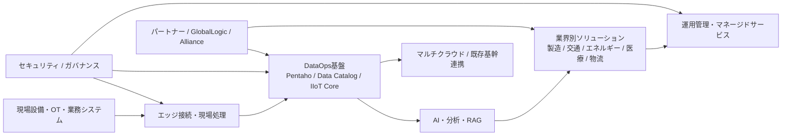

# 日立Lumadaの実務評価と主要SIer比較

## エグゼクティブサマリ

日立のLumadaは、単一のSaaS製品というより、**OT×IT×プロダクト**を横断してデータから価値を作るための「ソリューション群・サービス群・技術群」の総称です。現場データの取得、エッジ処理、データ統合、AI/分析、システム実装、運用保守、協創の場までを一体で持つ点が最大の特徴で、特に**社会インフラ、製造、交通、エネルギー**のようなミッションクリティカル領域で強みが出ます。DataOps系ではマルチクラウド対応、Kubernetesベースのスケーラブルな基盤、Pentaho等を核にしたデータ統合・ガバナンス、AI/RAG適用支援まで射程に入っています。加えて、HMAXやGlobalLogic/Hitachi Digital Servicesの統合強化により、Lumada 3.0ではAIを中核にした現場適用が前面に出ています。 citeturn12search2turn9view1turn12search10turn34search7turn7view1turn7view2turn12search9

比較すると、**富士通 Uvance / Data Intelligence PaaS**は経営意思決定・サプライチェーン・業務変革寄り、**NEC BluStellar**はAIガバナンス・モダナイゼーション・標準化されたDXオファリング寄り、**NTT系 Smart Data Platform**はネットワーク/マルチクラウド/閉域接続を生かしたデータ流通基盤寄り、**東芝 SPINEX**はエネルギー・産業OT・デジタルツイン/エッジ寄り、**三菱電機 Serendie**はFA/OT・鉄道・エネルギー・OTセキュリティを束ねる新しいデジタル基盤寄りです。つまり、Lumadaは最も“総合力”が高い一方、他社は用途別に尖りやすい構図です。 citeturn13search0turn38view2turn17view1turn17view5turn36search2turn36search3turn23search1turn23search2turn31view0turn32view0

実務上の結論は明確です。**現場接続・業界特化・長期運用まで含む大規模DX**ならLumadaが第一候補です。一方で、**意思決定高度化や業務データ統合を短中期で回したい**なら富士通やNEC、**まず安全なデータ流通基盤を作りたい**ならNTT系、**発電・プラントO&M最適化**なら東芝、**三菱電機製品群やFA/OTセキュリティとの親和性**を重視するならSerendieが有力です。なお、価格の透明性は全般に低く、公開価格が比較的見えるのは一部のHitachi/NEC/NTT系サービスに限られます。 citeturn33search0turn33search6turn18search5turn35view0turn35view1

## 比較の前提

今回の比較で重要なのは、各社の「同等プラットフォーム」が**同じ商品形態ではない**ことです。Lumada、Uvance、BluStellar、Serendieは、いずれも単一ソフトウェアよりは**価値創造モデル/共創基盤/オファリング体系**の色が強い一方、Smart Data PlatformとSPINEXは比較的**プロダクト化・サービス化**が進んだプラットフォームです。したがって、本レポートでは「製品機能」だけでなく、**アーキテクチャ、導入方法論、支援体制、業界別アセット、運用モデル**まで含めて比較しています。 citeturn12search2turn9view1turn37search1turn17view1turn31view0turn36search2turn4search1

また、NTTデータについては、Lumadaと同じ粒度の単独公開ブランドが分散しているため、本稿では**NTTグループの公開プラットフォームとしてSmart Data Platform**を比較対象に採用しました。これは、エッジ/クラウド、データ収集・蓄積・管理・分析、ネットワーク、監視、サポート、価格の公開度が揃っており、実務上の比較に最も使いやすいためです。 citeturn36search2turn36search3turn35view3

不明点の扱いは厳格にしています。公開価格や公開ROIがない項目は**「公開情報なし」**と明記し、TCOや導入期間は**相対指数による概算**として、根拠となる公開機能・導入事例・サポートモデルから推定しました。公開価格そのものは、日立の一部生成AI関連サービス、NECの一部AIガバナンス系サービス、NTT系SDPFのIaaS/サポートで確認できましたが、主要プラットフォーム本体は多くが個別見積です。 citeturn33search0turn33search6turn18search5turn35view0turn35view1

## Lumadaの製品・サービス分析

Lumadaの中核は、**データから価値を創るための共創フレームワーク**にあります。日立は公式に、Lumadaを「先進的なデジタル技術を活用したソリューション/サービス/テクノロジー」と位置付け、design-led digital engineeringを通じて、ソリューション設計、SI、connected products、managed servicesまでEnd-to-Endで提供すると説明しています。さらに、Lumada Innovation Hub、Lumada Alliance Program、Lumada Solution Hubを通じて、顧客・パートナー・専門人材を結びつける仕組みを明示しています。 citeturn12search2turn9view1turn10view0

上図は、日立のLumada公式概要、DataOps関連説明、生成AI支援、HMAX/AI強化、協創・運用支援の公開情報を踏まえた整理です。DataOps領域では、Lumada DataOps SuiteがKubernetesベースの分散クラウドネイティブ構成、共通コントロールプレーン、セルフサービス型データ準備を提供し、PentahoやData Catalog、IIoT Coreによりエッジからマルチクラウドまでのデータ運用を支えます。HMAXはAIを活用した新しいデジタルアセット管理群として位置付けられ、鉄道などではデジタルツインとエッジAIを組み合わせた構成が前面に出ています。 citeturn12search10turn34search7turn12search4turn10view1turn12search14turn12search9

AI/アナリティクスでは、Lumadaは単なるダッシュボード基盤ではなく、**生成AIの導入設計、RAGチューニング、人材育成**まで含めてサービス化しています。2024年開始の「生成AI活用プロフェッショナルサービス powered by Lumada」では、ユースケース創出、ユースケース実現性検証、RAG評価/チューニング、文書読み取り支援、人材育成までを7メニュー化し、日立は約1,000件のユースケース検証を通じて得たナレッジを活用するとしています。 citeturn7view1

セキュリティと運用の観点でも、Lumadaは比較的厚いです。Lumada公式の専門人材紹介では、サイバー/フィジカル両面で計画から運用まで支援する**Security Consulting**を掲げ、Hitachi VantaraはSupport Portal、Knowledge Base、Customer Success & Support、Managed Servicesを提供しています。さらに、2025年にはGlobalLogicとHitachi Systems Trusted Cyber Managementによる欧州向けサイバーセキュリティ運用センターを開設し、24時間365日のモニタリング提供を表明しました。 citeturn9view1turn34search0turn34search6

導入事例は非常に多く、業種の幅でも比較優位があります。Lumadaの公開事例には、交通（AMT GenovaのMaaS）、製造（Suntoryの次世代工場、Yamaha Motor、Daikin、Okuma、Daicel）、小売（Workman、Nojima）、金融（Hitachi Payment Services）、医療/介護（在宅ケア連携、再生医療トレーサビリティ）、都市/公共（TRAFFICSS）などが並びます。日本国内の定量効果としては、ニチレイ・アイスの需給計画事例で**計画立案時間を約70%削減**したことがLumada事例ページで示されています。 citeturn11view1turn11view2turn5search2

価格は限定的ながら一部公開されています。Lumada Solution Hubの**生成AIトライアル環境提供サービスは月額55万円～**、一方で「モダナイゼーション powered by Lumada」やLumada Solution Hub本体は**個別見積**です。つまり、PoCや試行導入の入口価格は見えるものの、大半の本番案件はSI/運用込みの提案型価格になります。 citeturn33search0turn33search1turn33search6

## 主要SIerとの比較

下表は、各社の公開情報をもとにした**機能マトリクス**です。記号は、**◎=強い、○=十分、△=公開情報または外販プロダクト化が限定的**を意味します。これは製品表の単純比較ではなく、機能・アーキテクチャ・導入方法論・運用体制を総合した実務評価です。 citeturn12search2turn37search1turn17view1turn36search2turn4search1turn31view0

| 企業 | 比較対象 | 位置づけ | 機能性 | 導入実績 | 業界特化性 | 拡張性・統合性 | AI/分析 | エッジ対応 | セキュリティ/運用 | パートナー | 実務上の見立て |
|---|---|---|---|---|---|---|---|---|---|---|---|
| 日立 | Lumada | 共創型の総合DX基盤 | ◎ | ◎ | ◎ | ◎ | ◎ | ◎ | ◎ | ◎ | OT/IT/業界アセット/運用の総合力が最も高い |
| 富士通 | Uvance / Data Intelligence PaaS | 事業変革＋データ意思決定基盤 | ◎ | ○ | ○～◎ | ◎ | ◎ | ○ | ○ | ◎ | 経営・SCM・データ統合案件で非常に強い |
| NEC | BluStellar | AX/DX価値創造モデル | ○～◎ | ○ | ○ | ○～◎ | ◎ | ○ | ◎ | ○ | AIガバナンス、モダナイゼーション、標準化に強い |
| NTT系 | Smart Data Platform | データ流通/接続/マルチクラウド基盤 | ○ | ○ | △～○ | ◎ | ○ | ○ | ◎ | ○ | ネットワーク起点で安全にデータ基盤を作るなら有力 |
| 東芝 | SPINEX | 産業IoT/CPS基盤 | ○～◎ | ○ | ◎ | ○ | ○～◎ | ◎ | ○ | ○ | エネルギー/プラント最適化で強い |
| 三菱電機 | Serendie | グループ横断の価値共創基盤 | ○ | △～○ | ○～◎ | ○ | ○ | ○ | ○～◎ | ◎ | 製造・鉄道・エネルギー・OTセキュリティで伸びしろ大 |

この比較で最も重要なのは、**Lumadaが“製品の足し算”ではなく、案件遂行能力まで含めたプラットフォーム**になっている点です。富士通はDI PaaSを中心にデータ統合・AI・ブロックチェーン・Palantir/Azure連携まで整理されており、業務意思決定系で非常に競争力があります。NECはBluStellar Offeringsで業種共通/業種別ベストプラクティスを標準化し、AI適用実績350以上、数百社展開を打ち出しています。NTT系SDPFは、収集・蓄積・管理・分析に加え、ネットワーク・監視・閉域接続までワンストップで用意されるため、構成管理やマルチクラウド接続で分かりやすい強みがあります。東芝はデジタルツイン、エッジ、メディアインテリジェンスを軸にしたSPINEXでエネルギー/社会インフラに深く、三菱電機はSerendieを核にAWS、Snowflake、Dataiku、MuleSoft等のパートナー連携を前提に、鉄道・FA・熱エネルギー・OTセキュリティへ横展開を進めています。 citeturn13search0turn38view2turn17view2turn17view5turn36search2turn36search3turn23search1turn23search2turn29view0turn32view0

要するに、**「広く深く」ならLumada**、**「データ駆動の意思決定」なら富士通**、**「AIガバナンスと標準オファリング」ならNEC**、**「安全な接続基盤」ならNTT系**、**「エネルギー・プラント」なら東芝**、**「FA/OTセキュリティ連携」なら三菱電機**という使い分けが最も実務的です。 citeturn7view1turn38view3turn19view2turn35view3turn26view0turn32view1

## 導入事例・価格・TCO比較

まず、**業種別の公開事例と効果**を見ると、Lumadaは業種の幅、三菱電機と富士通は定量効果、NTT系と東芝は運用改善の明確さが目立ちます。NECはBluStellarそのものを冠する個別事例より、オファリング/社内実践/業種横断事例ポータルの公開が中心です。 citeturn11view1turn16search0turn36search0turn32view0

| 企業 | 業種 | 公開事例 | 公開された効果・ROI | 出典 |
|---|---|---|---|---|
| 日立 | 食品製造/物流 | ニチレイ・アイス需給計画 | 計画立案時間を約70%削減 | 公式事例 citeturn5search2 |
| 日立 | 交通 | AMT Genova MaaS | 都市交通の統合、利便性向上と脱炭素寄与 | 公式事例 citeturn9view1turn11view1 |
| 日立 | 医療/介護 | 在宅ケア連携、再生医療トレーサビリティ | 業務効率化、サービス品質向上 | 公式事例 citeturn11view2 |
| 富士通 | 製造 | 小糸製作所 | 在庫データ集計時間を約50%短縮、約4か月で導入完了 | 顧客事例 citeturn38view3 |
| 富士通 | 製造 | Panasonic EW | 20万品番超の在庫可視化を2週間で実現 | 発表資料 citeturn13search7 |
| 富士通 | 自動車 | マツダ | 分散データ統合、集計負荷を大幅削減し迅速な意思決定を実現 | 発表資料 citeturn38view2 |
| NEC | IT運用 | NEC社内マルチクラウド統合運用 | 1,000以上のシステムを一元管理、運用コスト20%削減、リードタイム半減 | 技報/自社実践 citeturn17view5 |
| NTT系 | 小売/データ基盤 | セブン-イレブン・ジャパン | サイロ化した社内データを安全な経路でクラウド集約 | 公式事例 citeturn36search0 |
| NTT系 | 金融 | 金融業A社 | 閉域接続でセキュアなリモートアクセス、快適なWeb会議を実現 | 公式事例 citeturn36search5 |
| 東芝 | 化学製造/自家発電 | クラレ | 電気・蒸気供給の最適化、異常予兆検知、性能評価 | 公式事例 citeturn24view2 |
| 東芝 | 水力/発電 | 水力発電所保守支援 | 遠隔監視、運転支援、巡視支援、予兆診断で保守改善 | 公式技術情報 citeturn24view3 |
| 三菱電機 | 製造/FA | 三菱電機モビリティ姫路事業所 | 年7億円の生産・品質コスト削減、データ活用構築リードタイム90%以上削減 | 公式ストーリー citeturn32view0 |
| 三菱電機 | 鉄道/エネルギー | 鉄道向けデータ分析 | 回生電力見える化、鉄道アセット最適運用提案 | 公式ストーリー citeturn32view0 |

次に、**価格/ライセンス**です。ここは各社差が大きく、LumadaやBluStellar、Uvance、Serendieの“中核ブランド”自体は個別見積中心です。公開価格が見えるのは、日立の一部生成AIサービス、NECの一部AIガバナンス系、NTT系SDPFのIaaS/サポートです。したがって、金額だけで横比較するのではなく、**何が料金表に乗っているか**を確認する必要があります。 citeturn33search0turn33search6turn18search5turn35view0turn35view1

| 企業 | プラットフォーム | 公開価格モデル | 実務上の解釈 | 出典 |
|---|---|---|---|---|
| 日立 | Lumada | 生成AIトライアル環境提供サービスは月額55万円～。モダナイゼーション powered by Lumadaは個別見積。 | PoC入口は比較的明瞭だが、本番導入は提案型価格。 | 公式価格情報 citeturn33search0turn33search6 |
| 富士通 | Uvance / DI PaaS | 公開情報なし | 主要公開ページでは価格明示を確認できず、案件見積前提。 | 公式概要・事例確認 citeturn37search1turn13search0turn38view2 |
| NEC | BluStellar | BluStellar本体は公開情報なし。一方、関連するAIガバナンスサービスは500万円～。 | 中核ブランド自体は提案型。周辺オファリング単位で価格が見える。 | 公式発表 citeturn18search5turn17view1 |
| NTT系 | Smart Data Platform | サーバーインスタンスは月額4,700円～の公開料金あり。運用支援は5%/8%。 | IaaS/運用の透明性が高く、構成積み上げ型の見積がしやすい。 | 公式料金表 citeturn35view1turn35view0 |
| 東芝 | SPINEX | 公開情報なし。PoC/Value検証後に見積提示。 | 業界特化・個別最適が前提で、価格は高い提案自由度とトレードオフ。 | FAQ/導入フロー citeturn25view1turn26view0 |
| 三菱電機 | Serendie | 公開情報なし | 現時点では基盤ブランドの外販価格透明性は低い。 | 公式概要確認 citeturn31view0turn31view2 |

最後に、要望の多い**TCO比較の概算表**です。ここでは、基準値100を「単一業務・クラウド中心・標準コネクタ活用・24/365必須ではない案件」とし、①OT/現場接続の重さ、②デジタルツインや最適化モデルの個別性、③マネージド運用の厚さ、④既存システム統合範囲で補正した**相対指数**を示しています。金額換算ではなく、**調達・RFPでの相対感**を見るための表です。推定であることを明示します。 citeturn12search10turn17view5turn35view0turn26view0turn32view0

| 企業 | 3年TCO概算指数 | 初回本番化の目安 | TCOが上がりやすい理由 | 向く案件 |
|---|---:|---|---|---|
| 日立 Lumada | 130–160 | 4–12か月 | OT/IT統合、業界別モデル、運用保守まで含めると設計自由度が高くなる | 社会インフラ、製造、交通、エネルギーの大規模DX |
| 富士通 Uvance / DI PaaS | 115–145 | 2–6か月 | データ統合対象が広いほど設計が増えるが、DI PaaSで圧縮しやすい | SCM、経営意思決定、高速なデータ統合 |
| NEC BluStellar | 110–140 | 3–6か月 | 標準オファリングで抑制しやすいが、全社モダナイズは中規模以上になりやすい | AIガバナンス、モダナイゼーション、ハイブリッドクラウド |
| NTT系 SDPF | 100–130 | 1–4か月 | ネットワーク/クラウドは積み上げやすいが、業務アプリ側は別途費用が出やすい | 閉域接続、マルチクラウド、データ流通基盤 |
| 東芝 SPINEX | 120–155 | 3–9か月 | 最適化モデル、設備特性、PoC主導で個別対応が増えやすい | 発電、プラント、設備保全、エネルギー最適化 |
| 三菱電機 Serendie | 115–150 | 3–9か月 | 共創前提で要件設計幅が広く、外販標準価格が見えにくい | FA、鉄道、OTセキュリティ、熱/電力最適化 |

この表の読み方は単純で、**Lumadaは高めだが高機能・高伴走**、**SDPFは比較的見積しやすいが業務アセットは薄い**、**富士通/NECは中位で“業務変革寄り”の費用対効果が出やすい**、**東芝/三菱電機は設備・現場依存度が高いほど費用も成果も振れ幅が大きい**、という理解が実務に合います。 citeturn38view3turn17view5turn35view1turn26view0turn32view0

## 実務上の示唆

選定の観点で最も重要なのは、**「プラットフォームを買う」のか、「業界アセットと伴走を含む変革能力を買う」のか**を分けることです。前者ならNTT系SDPFや一部のNEC/富士通の構成が比較しやすく、後者ならLumadaやSPINEX、Serendieの価値が大きくなります。特にLumadaは、交通・エネルギー・製造・医療まで公開事例の幅が広く、共創拠点、アライアンス、専門人材、運用保守までを一体で説明できる点が、他社よりも実案件向きです。 citeturn11view1turn11view2turn10view0turn9view1

用途別には、**社会インフラ/製造/エネルギーの複合案件なら日立Lumada**、**SCMや経営意思決定基盤なら富士通 Uvance/DI PaaS**、**AIガバナンスと標準化を重視する全社DXならNEC BluStellar**、**閉域接続とマルチクラウドを軸にしたデータ流通ならNTT系SDPF**、**発電・プラントO&Mなら東芝SPINEX**、**三菱電機機器群やFA現場とOTセキュリティをつなぐならSerendie**が第一候補です。 citeturn38view2turn19view2turn35view3turn24view2turn32view1

RFPでは、少なくとも次の三点を分けて評価すべきです。第一に、**PoC費用と本番移行費用を分けること**。第二に、**データ統合・AI・運用保守・セキュリティのどこまでを標準、どこからを個別開発とするかを明記させること**。第三に、**ROI指標を“導入直後の工数削減”と“運用定着後の事業価値”に分けること**です。公開情報を見る限り、Lumadaと富士通は後者まで広げやすく、NTT系は前者の積み上げがしやすい、という差があります。 citeturn7view1turn38view3turn35view0turn35view1

総括すると、**Lumadaは最も「SIerプラットフォームらしい」総合選択肢**です。単純なIaaSやAI機能量だけなら競合はありますが、**業界知見、現場接続、AI/分析、マネージド運用、協創の仕組み**を一つの提案ストーリーとして出せる完成度では、現時点で日立が最もバランスしています。逆に言えば、課題が狭いなら他社の方が安く、早く、シンプルに入る可能性があります。したがって、Lumadaを選ぶべき案件は、**「広い・深い・長い」DX**です。そうでない案件では、富士通、NEC、NTT系、東芝、三菱電機の尖った強みが十分に勝ち得ます。 citeturn12search2turn9view1turn13search0turn17view1turn36search2turn4search1turn31view0